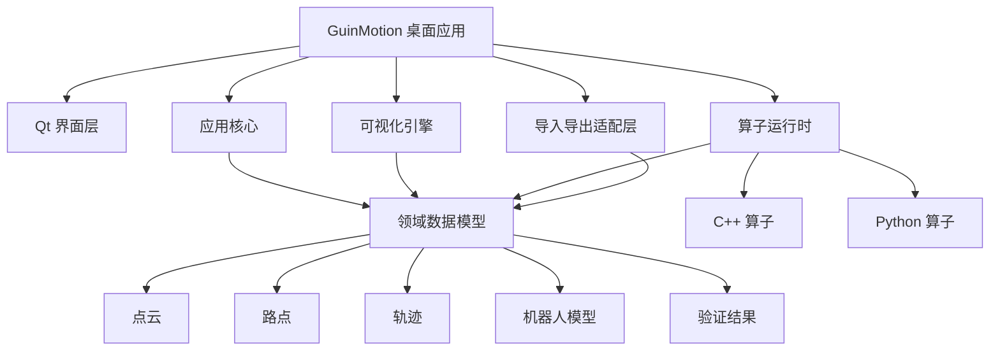

# GuinMotion 设计文档

GuinMotion 是一款面向机器人运动控制算法开发与验证的跨平台原生桌面软件。它重点支持点云可视化、点位与路点管理、轨迹可视化、机器人模型验证，以及通过 C++/Python 算子扩展多自由度机械臂算法能力。

## 产品定位

GuinMotion 的目标是成为机器人运动控制开发者的工程工作台：

- 导入机器人数据、点云、路点、轨迹和算法输出。
- 可视化点云、点、机器人状态、路点、轨迹和时间信息。
- 验证算法是否满足关节限制、几何环境和工艺约束。
- 通过插件导入 C++ 和 Python 算子，不需要重新编译主程序。
- 在 macOS 和 Ubuntu 上开箱即用，尽量减少外部运行依赖。

## 推荐技术基线

第一版建议采用：

- 主语言：C++20。
- 桌面界面：Qt 6 Widgets。
- 构建系统：CMake。
- 依赖管理：vcpkg manifest 模式。
- 核心数据模型：点云、点、路点、轨迹、机器人状态、算子输入输出。
- C++ 算子：通过稳定 C ABI 加载动态库。
- Python 算子：通过嵌入 CPython 和 pybind11 接入。
- 发布包：macOS 使用 `.app/.dmg`，Ubuntu 优先使用 AppImage。

## 文档索引

- [技术选型](technology-selection.md)：开发语言、GUI、可视化、算子、依赖和打包方案。
- [系统架构](system-architecture.md)：应用分层、核心模块、数据流、算子执行流、线程模型和扩展点。
- [算子插件设计](operator-plugin-design.md)：C++ 动态库插件、Python 嵌入式算子、ABI、生命周期、manifest 和安全边界。
- [可视化与数据模型](visualization-and-data-model.md)：点云、点、路点、轨迹、机器人模型、验证结果和视口管线。
- [跨平台构建与打包](cross-platform-build.md)：macOS/Ubuntu 构建、依赖管理、插件目录、Python runtime 和 CI 方案。

## 模块地图

## 第一阶段里程碑

第一阶段不应试图一次性覆盖所有机器人功能。建议先完成：

- Qt 桌面应用空壳。
- 项目模型和场景模型。
- XML 轨迹导入。
- 基础点云导入。
- 3D 视口中显示点云、路点和轨迹线。
- C++ 算子 SDK 示例。
- Python 算子示例，作为可选构建能力。
- macOS 和 Ubuntu 发布包烟测。

这个里程碑可以先验证架构、打包、数据模型和扩展机制，再逐步加入复杂运动规划和具体机器人能力。

## 依赖原则

GuinMotion 核心程序不应要求用户预先安装 ROS、PCL、厂商 SDK、CUDA 或 Python 包。相关能力可以通过可选适配器或插件提供。核心应用应保持小型、原生、可预测。

## 下一步工程动作

设计文档确认后，下一步可以创建工程骨架：

- CMake 项目。
- Qt 应用目标。
- Core 核心库目标。
- Operator SDK 目标。
- 第一个 C++ 示例算子。
- macOS 和 Ubuntu 基础 CI 构建。
