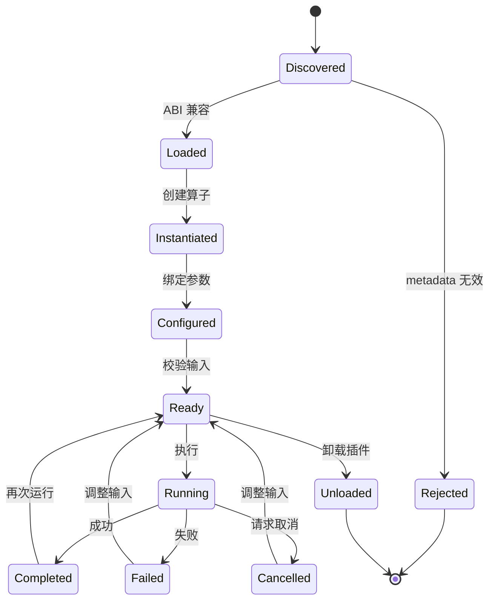
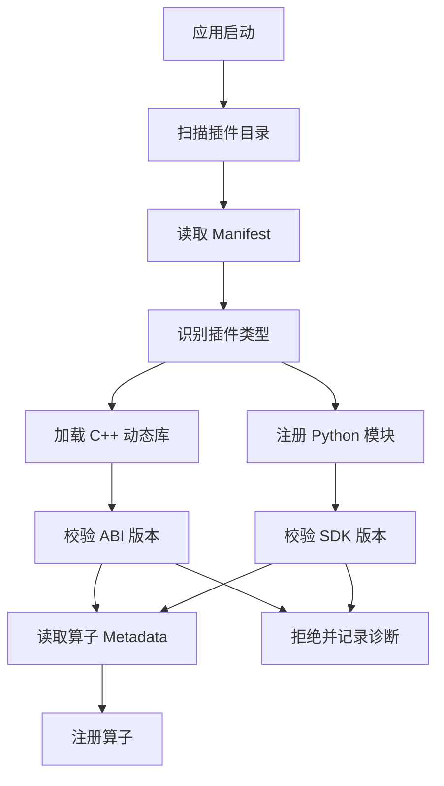

# 算子插件设计

## 目标

GuinMotion 的算子是可复用算法单元，用于机器人运动控制开发与验证。算子可以导入轨迹、处理点云、生成路点、评估机器人约束、验证碰撞风险，或在不同机器人模型之间转换数据。

第一版支持进程内算子：

- 原生 C++ 动态库算子。
- 嵌入式 CPython 执行的 Python 算子。

两类算子在应用层呈现为统一的算子模型。

## 算子概念

一个算子由以下信息描述：

- 稳定 ID。
- 展示名称。
- 版本号。
- 支持的 GuinMotion SDK ABI 版本。
- 输入端口。
- 输出端口。
- 参数。
- 执行约束。
- 可选预览能力。

算子不得直接访问 Qt 控件或应用内部对象。算子只能通过执行上下文和类型化数据句柄与主程序交互。

## 算子生命周期



## C++ 动态库边界

C++ 插件应导出 C 兼容入口。入口函数返回函数指针表和 metadata，避免跨库暴露编译器相关 C++ ABI。

概念入口：

```cpp
extern "C" GUINMOTION_EXPORT int guinmotion_get_plugin_api(
    uint32_t host_abi_version,
    GuinMotionPluginApi* out_api);
```

导出的 API 应包含：

- 查询插件 metadata。
- 查询算子数量。
- 按索引查询算子 metadata。
- 创建算子实例。
- 销毁算子实例。
- 可选插件级初始化和关闭。

SDK 可以提供 C++ 包装类，让算子作者无需手动填写所有函数指针。

## ABI 规则

为了保证插件加载可预测：

- 二进制边界使用 C struct、定长整数类型和 UTF-8 字符串。
- ABI 边界不传 STL 容器。
- ABI 边界不抛 C++ 异常。
- 内存所有权必须明确。
- 宿主和插件加载前交换 SDK ABI 版本。
- 插件 metadata 尽量记录编译器、平台、SDK 版本和构建类型。

如果发现 ABI 不匹配，插件应被拒绝加载，并给出清晰诊断。

## 算子 API 形态

概念 C++ SDK 接口：

```cpp
class Operator {
public:
  virtual ~Operator() = default;

  virtual OperatorMetadata metadata() const = 0;
  virtual ValidationResult validate(const OperatorInputs& inputs,
                                    const OperatorParameters& params) = 0;
  virtual ExecutionResult execute(const OperatorInputs& inputs,
                                  const OperatorParameters& params,
                                  ExecutionContext& context) = 0;
};
```

重要结果类型：

- `ValidationResult`：报告缺失输入、单位错误、不支持的机器人模型或参数错误。
- `ExecutionResult`：包含输出、日志、警告、指标和失败详情。
- `ExecutionContext`：提供进度、取消、日志、临时存储和只读服务访问。

## 数据交换

算子输入输出使用类型化句柄：

- `PointCloud`：点云。
- `PointSet`：点集。
- `WaypointSet`：路点集合。
- `Trajectory`：轨迹。
- `RobotModel`：机器人模型。
- `RobotState`：机器人状态。
- `Transform`：位姿变换。
- `Scalar`：标量。
- `Table`：表格数据。
- `String`：字符串。

大数据应使用共享不可变 buffer 或写时复制句柄在同一进程内传递。这样未来加入进程外执行时，可以在不改变算子模型的前提下补充序列化层。

## Python 算子运行时

Python 算子通过嵌入 CPython 运行。运行时提供一个轻量 Python 包，例如 `guinmotion_sdk`，把原生数据句柄映射为 Python 对象。

Python 算子示例：

```python
from guinmotion_sdk import Operator, port, parameter

class SmoothTrajectory(Operator):
    id = "example.smooth_trajectory"
    name = "Smooth Trajectory"
    version = "0.1.0"

    inputs = [port("trajectory", "Trajectory")]
    outputs = [port("smoothed", "Trajectory")]
    parameters = [parameter("window", "int", default=5)]

    def execute(self, inputs, params, context):
        context.report_progress(0.1, "Preparing trajectory")
        trajectory = inputs["trajectory"]
        return {"smoothed": trajectory}
```

Python 运行时应做到：

- 应用进程内只初始化一次。
- 从项目、用户和内置插件目录配置 `sys.path`。
- 禁止 Python 算子阻塞 UI 线程。
- 捕获 stdout、stderr、日志、异常和 traceback。
- Python runtime 在打包中作为可选能力。

## 插件发现



推荐插件目录：

- 应用内置插件。
- 用户插件。
- 项目本地插件。

项目本地插件应在用户明确信任后再加载。

## Manifest 格式

C++ 插件示例：

```json
{
  "id": "guinmotion.example.smoothing",
  "name": "Example Smoothing Operators",
  "version": "0.1.0",
  "type": "cpp",
  "entry": "libexample_smoothing",
  "sdkAbi": 1,
  "operators": [
    "example.smooth_trajectory"
  ]
}
```

Python 插件示例：

```json
{
  "id": "guinmotion.python.examples",
  "name": "Python Example Operators",
  "version": "0.1.0",
  "type": "python",
  "entry": "smooth_trajectory.py",
  "sdkAbi": 1
}
```

## 安全模型

进程内插件速度快，但与宿主共享进程。第一版应通过以下机制降低风险：

- ABI 版本校验。
- Manifest 校验。
- 执行前输入校验。
- 运行时取消 token。
- 插件边界结构化异常处理。
- 使用独立 worker 线程执行。
- 清晰日志和诊断信息。

已知限制：原生插件仍可能让应用崩溃。因此架构应保留未来支持进程外 runner 的可能，用于不可信或实验性插件。

## 版本策略

使用两个版本号：

- 产品版本：GuinMotion 应用发布版本。
- SDK ABI 版本：C++ 插件二进制兼容契约。

SDK ABI 版本只应在二进制兼容性破坏时变化。新增可选能力应尽量通过 feature flag 或扩展表实现。

## 最小示例算子

第一批 SDK 验证算子建议包括：

- 加载轨迹算子。
- 保存轨迹算子。
- 路点插值算子。
- 轨迹时长检查算子。
- 关节限位检查算子。
- 点云裁剪或降采样算子。

这些示例可以在不引入大型机器人栈的情况下验证 API 设计。
