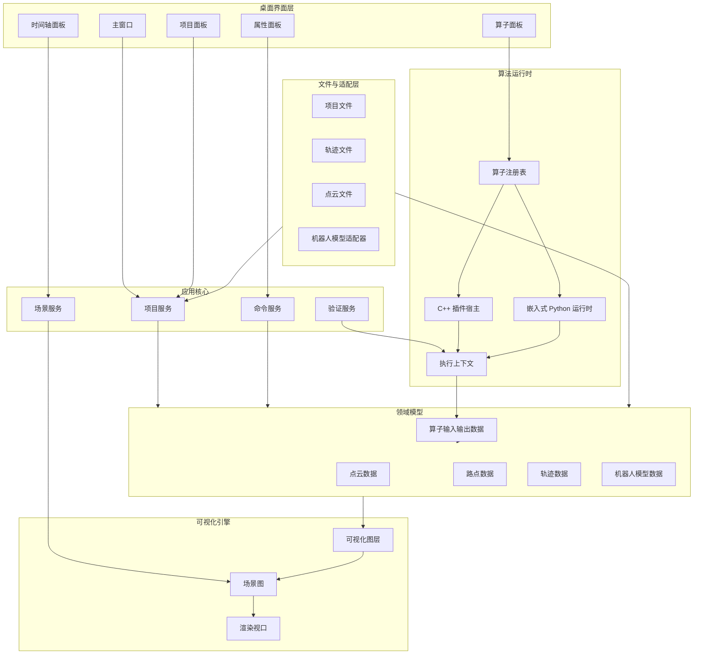
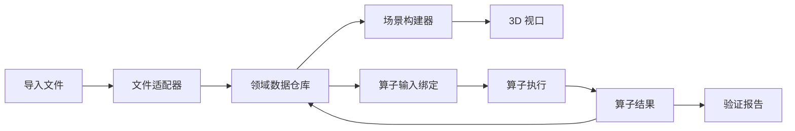
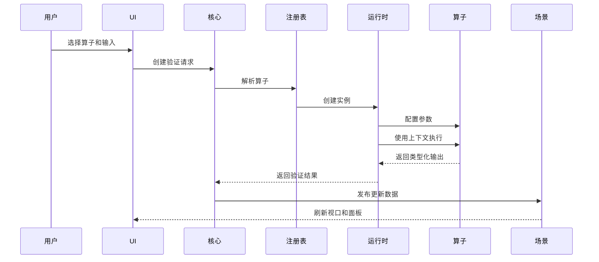

# GuinMotion 系统架构

## 架构原则

GuinMotion 应组织为一个原生桌面应用：核心小而稳定，外围能力通过适配器和插件扩展。应用需要开箱可用，但不能把所有机器人算法库、点云库和厂商 SDK 都塞进主程序。

核心原则：

- 应用核心负责数据模型和工作流状态。
- UI 模块不直接依赖插件实现细节。
- 可视化模块消费场景数据，不拥有源数据。
- 算子通过类型化输入输出通信，不操作 UI 对象。
- 文件格式和机器人适配器围绕核心模型扩展。

## 逻辑架构

## 模块职责

### 桌面界面层

UI 层负责展示项目、场景、算子、时间轴和属性。UI 应调用应用服务，不应直接修改领域对象。

推荐面板：

- 项目浏览器：数据集、机器人模型、轨迹、算子、验证运行记录。
- 3D 视口：点云、路径、路点、机器人状态、选中几何体。
- 时间轴：轨迹时长、路点顺序、插值预览。
- 算子面板：已导入算子、参数表单、执行状态。
- 属性检查器：选中对象的 metadata 和可编辑参数。

### 应用核心

应用核心协调具体用例：

- 加载和保存项目。
- 导入和导出点云、路点、轨迹、机器人模型。
- 应用带撤销/重做能力的命令。
- 触发算子验证运行。
- 向可视化模块发布场景更新。

核心应保持与 UI 无关。这样后续可以复用核心开发 CLI、自动化测试和批量验证工具。

### 领域模型

领域模型是应用稳定中心，应包含：

- 点云。
- 点和标注。
- 路点。
- 关节空间和笛卡尔轨迹。
- 机器人模型和当前机器人状态。
- 算子定义、参数、输入、输出和运行结果。

模型必须显式处理单位。关节角导入时应声明弧度或角度，内部统一归一化为弧度。

### 可视化引擎

可视化引擎渲染由领域模型派生出的场景图，不拥有源数据。源数据保存在领域模型中，可视化图层只负责转换为可渲染几何。

这种分离带来：

- 更快的视口刷新。
- 后台数据处理。
- 多种视图模式。
- 无 UI 的算法测试能力。

### 算法运行时

运行时负责加载算子、校验 metadata、创建执行上下文、运行算法，并把输出转换回领域对象。

第一版运行时范围：

- C++ 动态库算子。
- 嵌入式 Python 算子。
- 先支持同步执行。
- 较长任务放入后台 worker 线程。
- 结构化日志和结果对象。

### 文件与适配层

文件适配器负责把外部格式转换为内部数据模型。外部库类型不应泄漏到核心层。

可能的适配器：

- 项目 JSON 或 YAML。
- 点云：PCD、PLY、XYZ、CSV。
- 轨迹：XML、JSON、CSV。
- 机器人模型：先支持最小内部机器人格式，后续支持 URDF。

## 运行时数据流

## 算子执行流

## 线程模型

第一版建议采用保守线程模型：

- UI 线程：只处理 Qt 事件循环和控件更新。
- 核心线程：处理轻量命令和项目操作。
- Worker 池：处理重型导入、点云处理和算子执行。
- 渲染线程或渲染回调：由 Qt 渲染集成管理。

规则：

- 插件不得直接调用 UI API。
- 算子接收执行上下文和进度汇报器。
- Worker 产生的领域数据更新必须通过核心服务提交。
- 长耗时操作应尽量支持取消。

## 错误处理

错误应结构化并可展示：

- 用户可读消息。
- 技术细节。
- 来源模块。
- 关联输入对象。
- 可选修复建议。

核心应区分验证失败和应用错误。算法返回“轨迹无效”是合法结果，不应被视为程序崩溃。

## 未来扩展点

架构应预留：

- 可选 ROS 2 桥接。
- 进程外算子沙箱。
- 远程机器人连接适配器。
- GPU 加速点云处理。
- 基于同一核心的批量验证 CLI。
- 数据模型稳定后的脚本化工作流。
