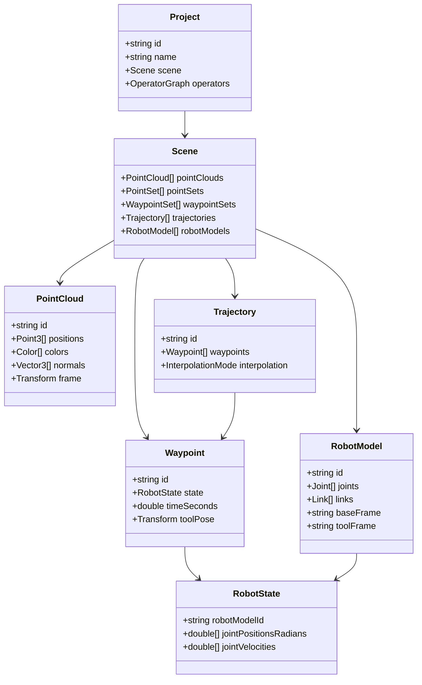
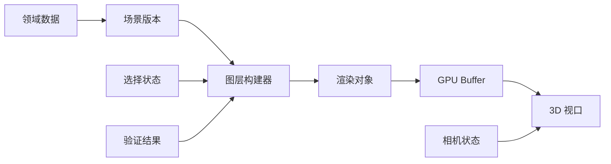

# 可视化与数据模型

## 目标

GuinMotion 需要一套稳定的内部数据模型，用于表达点云、点、路点、轨迹、机器人状态和机器人模型。可视化应建立在领域模型之上，而不是让渲染系统成为数据本身。

这种分离可以让同一份数据同时服务于 3D 可视化、算法算子、验证报告、导入导出适配器、自动化测试和未来 CLI 工具。

## 数据模型总览

## 单位与坐标系

内部统一单位：

- 长度：米。
- 角度：弧度。
- 时间：秒。
- 位姿：右手 3D 坐标系。
- 颜色：线性或 sRGB，由数据源声明。

导入适配器必须记录源单位，并转换到内部单位。关节角导入时要明确是角度还是弧度，内部统一为弧度。

常用坐标系：

- `world`：项目级世界坐标系。
- `robot_base`：机器人基座坐标系。
- `tool`：末端执行器坐标系。
- `sensor`：点云传感器坐标系。
- 用户自定义工装、工件和标定点坐标系。

## 点云模型

点云模型应支持大规模数据并避免不必要拷贝。

推荐字段：

- 坐标：必需，3D float 或 double。
- 颜色：可选。
- 法向：可选。
- 强度：可选。
- 标签：可选语义标签或实例标签。
- 坐标系：点云局部坐标到 `world` 的变换。
- 来源 metadata：文件路径、导入时间、传感器、单位和滤波历史。

性能策略：

- 大数组使用连续 buffer。
- 核心、可视化和算子共享不可变 buffer。
- GPU 渲染 buffer 与源数据分离。
- 大点云支持降采样预览图层。

## 点与标注模型

单点标注可用于标定、抓取候选点、测量标记和算法调试输出。

点标注字段包括位置、可选法向量、标签、颜色、参考坐标系和置信度。标注对象应足够轻量，便于算子快速创建。

## 路点模型

路点表示工艺流程中某一步的机器人状态。

必需字段：

- ID。
- 机器人模型 ID。
- 关节位置，内部统一为弧度。
- 可选时间戳或持续时间。
- 可选工具位姿。
- 可选标签。

可选字段：

- 关节速度和加速度。
- 工具速度。
- 融合半径。
- 用户备注。
- 验证状态。

对于多臂或多关节组机器人，第一版可先使用扁平关节数组加机器人模型 metadata；双臂流程稳定后再加入命名关节组，例如 `left_arm` 和 `right_arm`。

## 轨迹模型

轨迹是有序路点序列，加上时间和插值规则。

轨迹字段：

- ID。
- 机器人模型 ID。
- 路点列表。
- 插值模式。
- 总时长。
- 来源 metadata。
- 验证结果。

支持的轨迹空间：

- 关节空间轨迹。
- 笛卡尔工具轨迹。
- 同时包含关节状态和工具位姿的混合轨迹。

验证结果应附加到轨迹上，但不修改原始轨迹。结果可以包含关节限位、速度限制、加速度限制、碰撞风险、奇异点风险和对应算子运行记录。

## 机器人模型

第一版内部机器人模型应小而实用：

- 连杆名称。
- 关节名称。
- 关节类型。
- 父子关系。
- 关节限制。
- 默认 home 状态。
- 可视几何引用。
- 碰撞几何引用。
- 基座和工具坐标系。

URDF、厂商机器人描述和更复杂动力学模型应通过适配器映射到内部模型，而不是成为核心类型。

## 可视化管线

可视化层负责把领域数据转换为渲染对象，包括点云、轨迹折线、路点标记、机器人连杆、坐标系、测量和标注对象。场景版本变化时重建渲染对象，大点云应尽量支持局部更新。

## 视图与交互

第一版建议支持：

- 点云视图。
- 轨迹视图。
- 机器人状态视图。
- 综合验证视图。
- 选中路点聚焦视图。

核心交互：

- 选择点、路点、轨迹、机器人或算子结果。
- 查看和编辑属性。
- 拖动轨迹时间轴。
- 预览某个路点的机器人姿态。
- 测量点之间距离。
- 切换图层可见性。
- 相机适配选中对象。

算子可以发布预览输出。预览输出在用户接受前，应与已提交项目数据有视觉区分。

## 导入与导出

第一批导入导出目标：

- 带关节数组和 `duration` 的 XML 轨迹文件。
- CSV 路点和点文件。
- PLY 和 PCD 点云。
- JSON 项目文件。

导入适配器必须校验关节数量、单位、duration、时间字段和点云规模，避免把错误数据直接写入领域模型。

## 验证叠加层

验证叠加层应由模型驱动：

- 算子产出结果对象。
- 场景图层读取结果标注。
- 视口对受影响的点、路点或轨迹段着色。

状态建议包括 `Unknown`、`Valid`、`Warning`、`Error` 和 `Skipped`。数据模型应同时保留算法原始输出和用户友好的摘要状态。

## 第一版范围

第一版建议实现：

- 项目场景模型。
- 点云模型，先支持 PLY/PCD 或一种简单文本格式。
- 路点和轨迹模型，支持 XML 导入。
- 基础机器人模型，包含关节名称和限制。
- 3D 视口图层：点云、路点标记、轨迹线和选中机器人状态占位。
- 对路点和轨迹段的验证结果叠加。

这套范围足以开始验证机器人运动算法，同时不要求第一天就引入完整机器人生态。
